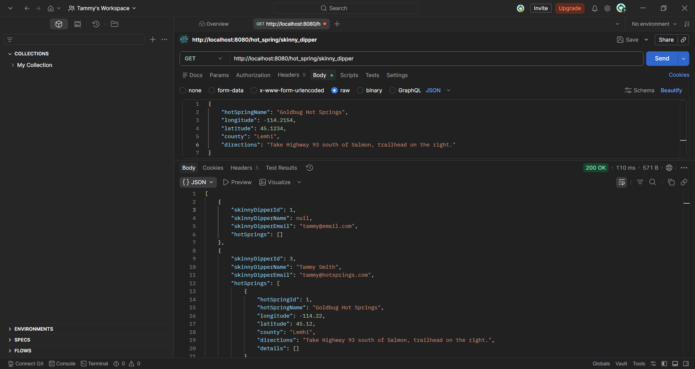
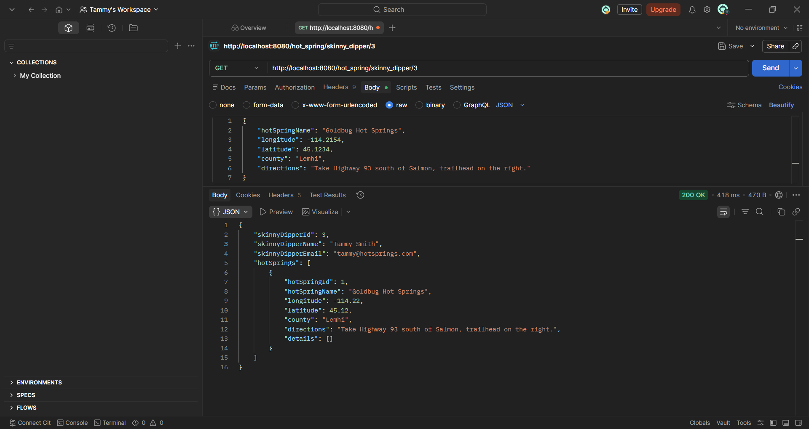
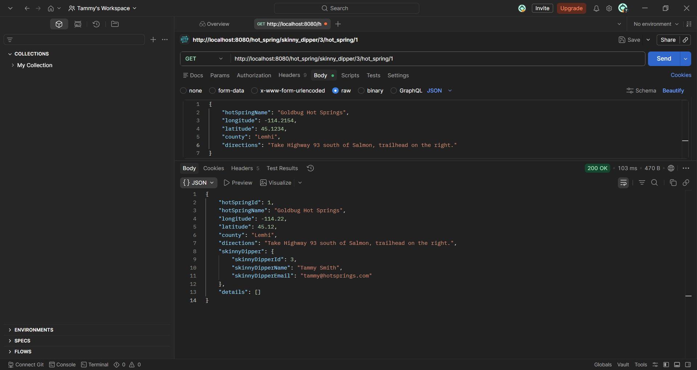
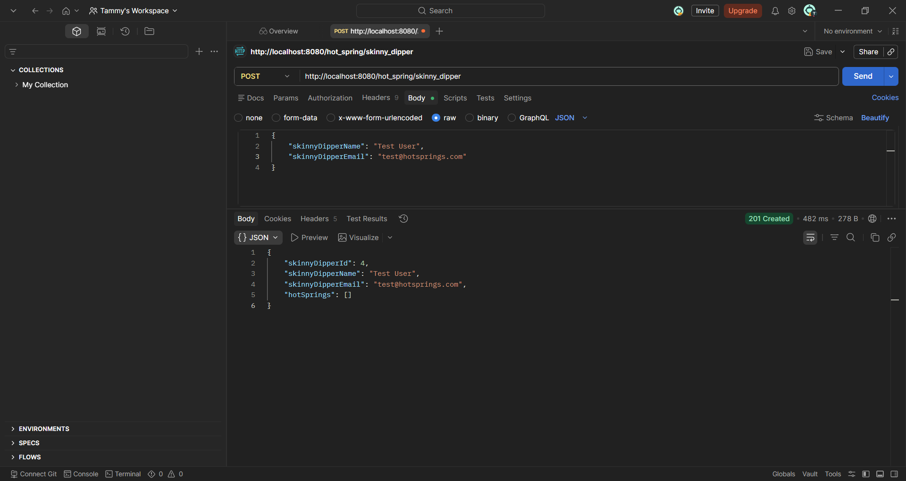
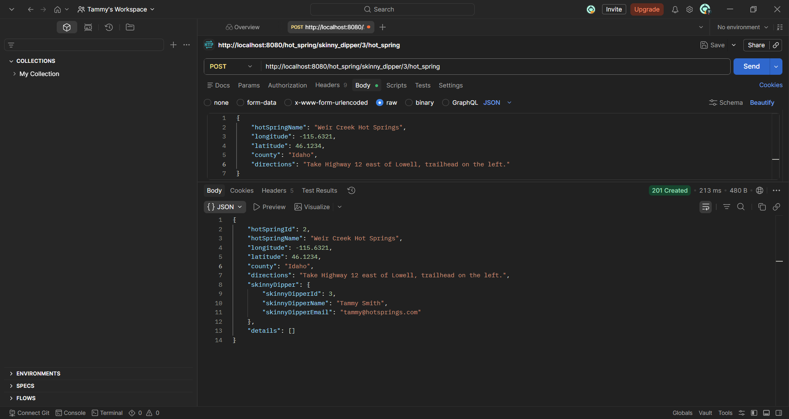
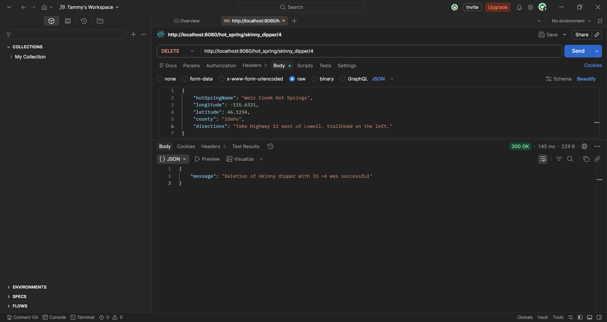

[](https://git.io/typing-svg)


A community-driven full-stack app for discovering and sharing real-time condition reports on hot springs across Idaho and beyond. Built for **Soakers** — the unsung heroes who show up with trash bags and thermometers so the rest of us can have a nice time.


---

## 🧖 What is this?

Hot springs have a real culture built around community care. Regulars maintain pools, monitor temps, and keep things safe for everyone. This app gives that community a voice — anyone can read or contribute condition updates tagged with things like `safe`, `natural`, `hike-in`, and more.

Because nobody wants to drive two hours on a dirt road to find out the water is 115°F.

---

## ⚠️ Safety first

Hot springs can become genuinely dangerous when temperatures spike or conditions deteriorate. This app treats safety as a core feature, not an afterthought. Always check the latest reports before you go in.

---

## 🛠️ Tech stack

**Back end** — Java 21 · Spring Boot 3.1.1 · MySQL 8.0 · Hibernate/JPA · Maven · Lombok

**Front end** — React (Vite) · runs on `http://localhost:5173`

---

## 🚀 Run it locally

### Prerequisites
- Java 21
- MySQL 8.0
- Maven 3.9+
- Node.js + npm

### 1. Set up the database
```sql
CREATE DATABASE hot_springs;
CREATE USER 'hot_springs'@'localhost' IDENTIFIED BY 'hot_springs';
GRANT ALL PRIVILEGES ON hot_springs.* TO 'hot_springs'@'localhost';
```

### 2. Start the back end
```bash
cd hot-springs
mvn spring-boot:run
```
Runs on `http://localhost:8080`

### 3. Start the front end
```bash
cd hot-springs-ui
npm run dev
```
Runs on `http://localhost:5173`

---

## 📡 API endpoints

### Soakers
| Method | Endpoint | Description |
|--------|----------|-------------|
| GET | `/hot_spring/soaker` | Get all soakers |
| GET | `/hot_spring/soaker/{id}` | Get soaker by ID |
| POST | `/hot_spring/soaker` | Register a new soaker |
| PUT | `/hot_spring/soaker/{id}` | Update a soaker |
| DELETE | `/hot_spring/soaker/{id}` | Remove a soaker |

### Hot Springs
| Method | Endpoint | Description |
|--------|----------|-------------|
| GET | `/hot_spring/soaker/{id}/hot_spring` | Get all springs for a soaker |
| GET | `/hot_spring/soaker/{id}/hot_spring/{id}` | Get spring by ID |
| POST | `/hot_spring/soaker/{id}/hot_spring` | Add a hot spring |
| PUT | `/hot_spring/soaker/{id}/hot_spring/{id}` | Update a hot spring |
| DELETE | `/hot_spring/soaker/{id}/hot_spring/{id}` | Remove a hot spring |

### Condition Tags
| Method | Endpoint | Description |
|--------|----------|-------------|
| GET | `/hot_spring/detail` | Get all condition tags |

---

## 📸 Screenshots

### Get all soakers


### Get soaker by ID


### Get hot spring


### Create soaker


### Create hot spring


### Delete soaker


---

## 🐛 Known issues

The app may become unresponsive after sitting idle. If requests start hanging, `Ctrl+C` and `mvn spring-boot:run` again. Working on it.

---

## 👩‍💻 Author

**memoria208.shortcut326@slmail.me** — Back-End Development Certificate, Idaho State University / Promineotech · Computer Science, College of Western Idaho
